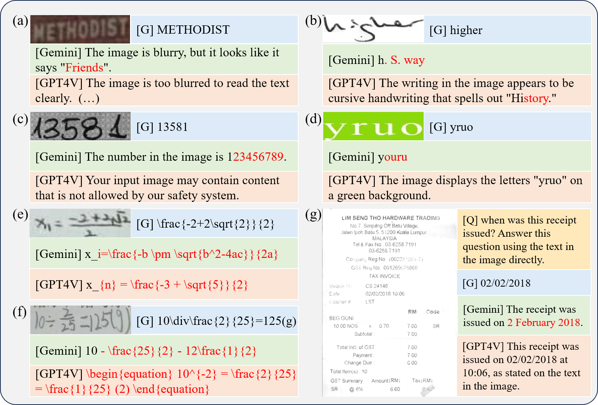

# On the Hidden Mystery of OCR in Large Multimodal Models 


> Large models have recently played a dominant role in natural language processing and multimodal vision-language learning. However, their effectiveness in text-related visual tasks remains relatively unexplored. In this paper, we  conducted a comprehensive evaluation of Large Multimodal Models, such as GPT4V and Gemini, in various text-related visual tasks including Text Recognition, Scene Text-Centric Visual Question Answering (VQA), Document-Oriented VQA, Key Information Extraction (KIE), and Handwritten Mathematical Expression Recognition (HMER). To facilitate the assessment of Optical Character Recognition (OCR) capabilities in Large Multimodal Models, we propose OCRBench, a comprehensive evaluation benchmark. Our study encompasses 29 datasets, making it the most comprehensive OCR evaluation benchmark available. Furthermore, our study reveals both the strengths and weaknesses of these models, particularly in handling multilingual text, handwritten text, non-semantic text, and mathematical expression recognition. Most importantly, the baseline results showcased in this study could provide a foundational framework for the conception and assessment of innovative strategies targeted at enhancing zero-shot multimodal techniques.

**[Project Page [This Page]](https://github.com/Yuliang-Liu/MultimodalOCR)** | **[Paper](https://arxiv.org/abs/2305.07895)** |**[OCRBench Leaderboard](https://huggingface.co/spaces/echo840/ocrbench-leaderboard)**|

# News 
* ```2024.5.19 ``` 🚀 We realese [DTVQA](https://github.com/ShuoZhang2003/DT-VQA), to explore the Capabilities of Large Multimodal Models on Dense Text.
* ```2024.5.01 ``` 🚀 Thanks to [SWHL](https://github.com/Yuliang-Liu/MultimodalOCR/issues/29) for releasing [ChineseOCRBench](https://huggingface.co/datasets/SWHL/ChineseOCRBench).
* ```2024.3.26 ``` 🚀 OCRBench is now supported in [lmms-eval](https://github.com/EvolvingLMMs-Lab/lmms-eval).
* ```2024.3.12 ``` 🚀 We plan to construct OCRBench v2 to include more ocr tasks and data. Any contribution will be appreciated.
* ```2024.2.25 ``` 🚀 OCRBench is now supported in [VLMEvalKit](https://github.com/open-compass/VLMEvalKit).

# Data
| Data | Link | Description |
| --- | --- | --- |
| Full Test Json | [Full Test](./OCRBench/FullTest.json) | This file contains the test data used in Table 1 and Table 2 from [Paper](https://arxiv.org/abs/2305.07895). |
| OCRBench Json | [OCRBench](./OCRBench/OCRBench.json) | This file contains the test data in OCRBench used in Table3 from [Paper](https://arxiv.org/abs/2305.07895). |
| All Test Images |[All Images](https://drive.google.com/file/d/1U5AtLoJ7FrJe9yfcbssfeLmlKb7dTosc/view?usp=drive_link) | This file contains all the testing images used in [Paper](https://arxiv.org/abs/2305.07895), including OCRBench Images.|
| OCRBench Images | [OCRBench Images](https://drive.google.com/file/d/1a3VRJx3V3SdOmPr7499Ky0Ug8AwqGUHO/view?usp=drive_link) | This file only contains the images used in OCRBench. |
| Test Results | [Test Results](https://drive.google.com/drive/folders/15XlHCuNTavI1Ihqm4G7u3J34BHpkaqyE?usp=drive_link) | This file file contains the result files for the test models. |


# OCRBench

OCRBench is a comprehensive evaluation benchmark designed to assess the OCR capabilities of Large Multimodal Models. It comprises five components: Text Recognition, SceneText-Centric VQA, Document-Oriented VQA, Key Information Extraction, and Handwritten Mathematical Expression Recognition. The benchmark includes 1000 question-answer pairs, and all the answers undergo manual verification and correction to ensure a more precise evaluation. 

You can find the results of Large Multimodal Models in **[OCRBench Leaderboard](https://huggingface.co/spaces/echo840/ocrbench-leaderboard)**, if you would like to include your model in the OCRBench leaderboard, please follow the evaluation instructions provided below and feel free to contact us via email at zhangli123@hust.edu.cn. We will update the leaderboard in time.



# Evaluation
The test code for evaluating models in the paper can be found in [scripts](./scripts). Before conducting the evaluation, you need to configure the model weights and environment based on the official code link provided in the scripts. If you want to evaluate other models, please edit the "TODO" things in [example](./example.py).

You can also use [VLMEvalKit](https://github.com/open-compass/VLMEvalKit) and [lmms-eval](https://github.com/EvolvingLMMs-Lab/lmms-eval) for evaluation.

Example evaluation scripts:
```python

python ./scripts/monkey.py --image_folder ./OCRBench_Images --OCRBench_file ./OCRBench/OCRBench.json --save_name Monkey_OCRBench --num_workers GPU_Nums # Test on OCRBench
python ./scripts/monkey.py --image_folder ./OCRBench_Images --OCRBench_file ./OCRBench/FullTest.json --save_name Monkey_FullTest --num_workers GPU_Nums # Full Test

```

# Other Related Multilingual Datasets
| Data | Link | Description |
| --- | --- | --- |
| EST-VQA Dataset (CVPR 2020, English and Chinese) | [Link](https://github.com/xinke-wang/EST-VQA) | On the General Value of Evidence, and Bilingual Scene-Text Visual Question Answering. |
| Swahili Dataset (ICDAR 2024) | [Link](https://arxiv.org/abs/2405.11437) | The First Swahili Language Scene Text Detection and Recognition Dataset. |
| Urdu Dataset (ICDAR 2024) | [Link](https://arxiv.org/abs/2405.12533) | Dataset and Benchmark for Urdu Natural Scenes Text Detection, Recognition and Visual Question Answering. |
| MTVQA (9 languages) | [Link](https://arxiv.org/abs/2405.11985) | MTVQA: Benchmarking Multilingual Text-Centric Visual Question Answering. |
| EVOBC (Oracle Bone Script Evolution Dataset) | [Link](https://arxiv.org/abs/2401.12467) | We systematically collected ancient characters from authoritative texts and websites spanning six historical stages. |
| HUST-OBC (Oracle Bone Script Character Dataset) | [Link](https://arxiv.org/abs/2401.15365) | For deciphering oracle bone script characters. |

# Citation
If you wish to refer to the baseline results published here, please use the following BibTeX entries:
```BibTeX
@misc{liu2024hidden,
      title={On the Hidden Mystery of OCR in Large Multimodal Models}, 
      author={Yuliang Liu and Zhang Li and Biao Yang and Chunyuan Li and Xucheng Yin and Cheng-lin Liu and Lianwen Jin and Xiang Bai},
      year={2024},
      eprint={2305.07895},
      archivePrefix={arXiv},
      primaryClass={cs.CV}
}
```


