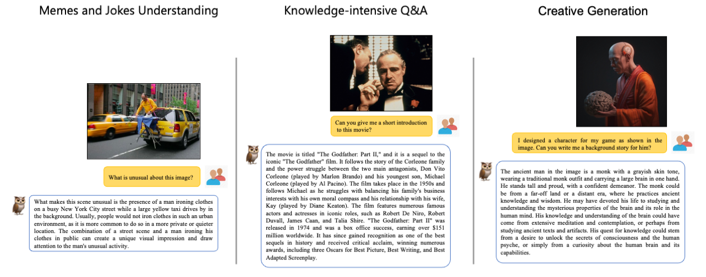
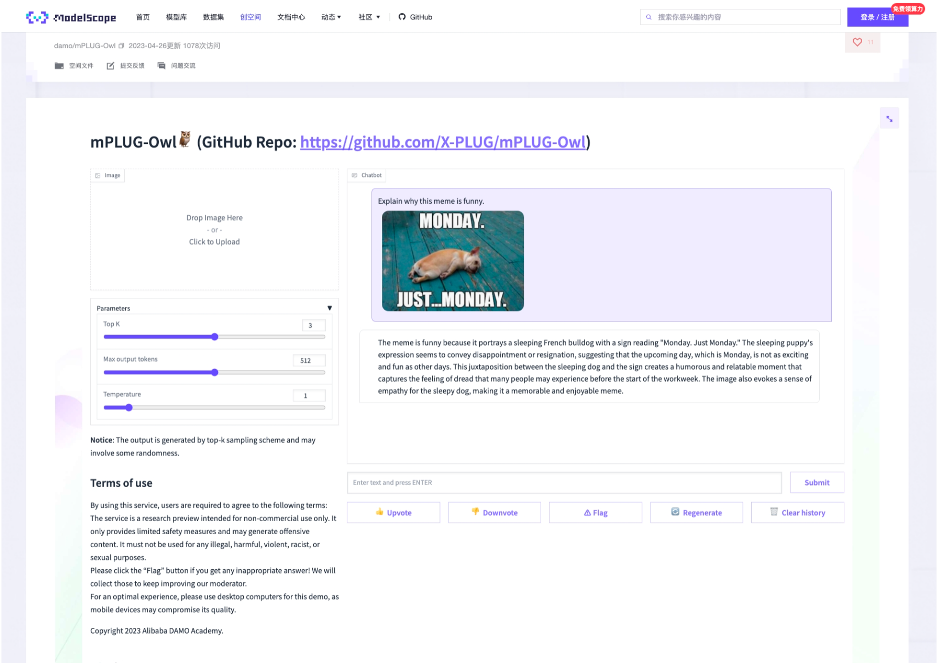

<div align="center">

</div>

# mPLUG-Owl🦉: Modularization Empowers Large Language Models with Multimodality
<div align="center">
Qinghao Ye*, Haiyang Xu*, Guohai Xu*, Jiabo Ye, Ming Yan†, Yiyang Zhou, Junyang Wang, Anwen Hu, Pengcheng Shi, Yaya Shi, Chaoya Jiang, Chenliang Li, Yuanhong Xu, Hehong Chen, Junfeng Tian, Qian Qi, Ji Zhang, Fei Huang
</div>

<div align="center">
<strong>阿里巴巴集团，达摩院</strong>
</div>

<div align="center">
*Equal Contribution; † Corresponding Author
</div>

<div align="center">
    <a href="https://huggingface.co/spaces/MAGAer13/mPLUG-Owl"></a>
    <a href="https://modelscope.cn/studios/damo/mPLUG-Owl/summary"></a>
    <a href="https://github.com/X-PLUG/mPLUG-Owl/blob/main/LICENSE"></a>
    <a href="http://mm-chatgpt.oss-cn-zhangjiakou.aliyuncs.com/mplug_owl_demo/released_checkpoint/mPLUG_Owl_paper.pdf"></a>
    <a href="https://arxiv.org/abs/2304.14178"></a>
    <a href="https://hits.seeyoufarm.com"></a>
    <a href="https://twitter.com/xuhaiya2483846/status/1654640739010351106"></a>
</div>

<div align="center">
<a href="README.md">English</a> | <a>简体中文</a>
<hr>
</div>

<!--
[](https://huggingface.co/spaces/MAGAer13/mPLUG-Owl)
[](https://modelscope.cn/studios/damo/mPLUG-Owl/summary)
[](https://github.com/X-PLUG/mPLUG-Owl/blob/main/LICENSE)
[](http://mm-chatgpt.oss-cn-zhangjiakou.aliyuncs.com/mplug_owl_demo/released_checkpoint/mPLUG_Owl_paper.pdf)
[](https://arxiv.org/abs/2304.14178)
[](https://hits.seeyoufarm.com)

[English](README.md) | 简体中文
<hr>
-->
<div align="center">

</div>

## 示例



## 最新更新
* 🔥 [05.19] mPLUG-Owl现在*原生支持 Huggingface*的用法和支持Huggingface Trainer训练，仅需*1张32G的V100*即可开启训练! 我们重构了代码移除了Apex的依赖. 离线Demo支持*8比特*进行推理，仅需要1张*16GB T4*即可部署! 
* 🔥 [05.16] 我们基于视频图文数据联合训练了我们的模型，在线demo已经更新。更新后的checkpoint和代码会很快和大家见面！
* 🔥 [05.16] [HuggingFace](https://huggingface.co/spaces/MAGAer13/mPLUG-Owl) 上的在线demo现在支持8bit了！
* 🔥 [05.12] 在线 demo 和 API 已经开放在[Replicate](https://replicate.com/joehoover/mplug-owl)!
* [05.05] 我们发布了指令微调的代码。
* [05.05] 我们在[HuggingFace](https://huggingface.co/spaces/MAGAer13/mPLUG-Owl)上也搭建了Demo。感谢HuggingFace提供的免费算力！
* [05.05] HuggingFace上的Demo现在已经支持视频输入！ModelScope上的Demo也即将支持。
* [05.05] 我们公开了视觉相关指令的测评集**OwlEval**
* [04.26] 我们在Modelscope上提供了一个[在线Demo](https://modelscope.cn/studios/damo/mPLUG-Owl/summary)供大家体验。
* [04.26] 我们开放了mPLUG-Owl🦉，以及推理代码和二阶段微调参数。

## 亮点特色
* 一种面向多模态语言模型的**模块化**的训练范式。
* 能学习与语言空间相适应的视觉知识，并支持在多模态场景(支持图片、视频、文本输入)下进行**多轮对话**。
* 涌现**多图关系理解**，**场景文本理解**和**基于视觉的文档理解**等能力。
* 提出了针对视觉相关指令的测评集**OwlEval**，用以评估多模态语言模型的对带有视觉信息上下文的理解能力。
* 我们在模块化上的一些探索:
  * [E2E-VLP](https://aclanthology.org/2021.acl-long.42/), [mPLUG](https://aclanthology.org/2022.emnlp-main.488/) 和 [mPLUG-2](https://arxiv.org/abs/2302.00402), 分别被ACL 2021, EMNLP 2022 and ICML 2023接收。
  * [mPLUG](https://aclanthology.org/2022.emnlp-main.488/) 首次在[VQA Challenge](https://eval.ai/web/challenges/challenge-page/830/leaderboard/2278)上超越人类。
* 即将发布
  - [ ] 多语言支持（中文、日文等）。
  - [ ] 在多图片/视频数据上训练的模型
  - [X] 在HuggingFace Hub上发布。
  - [x] Huggingface 在线Demo
  - [x] 指令微调代码。
  - [x] 视觉相关指令的测评集**OwlEval**

## 与v0版本的兼容性
我们在main分支上将代码用huggingface的使用风格进行了完整重构，同时对模型中的一些错误进行了修复并重新训练，因此新的checkpoint和旧的代码是不兼容的。我们已经将旧的代码移到v0分支，你可以切换到v0分支以使用先前的checkpoints。


## 在线Demo
### ModelScope
<a href="https://www.modelscope.cn/studios/damo/mPLUG-Owl/summary"></a>

### Hugging Face
<!-- [](https://www.modelscope.cn/studios/damo/mPLUG-Owl/summary) -->

[](https://huggingface.co/spaces/MAGAer13/mPLUG-Owl)

## 模型权重 Huggingface Model Hub
|Model|Phase|Download link|
|-|-|-|
|mPLUG-Owl 7B|Pre-training|[下载链接](https://huggingface.co/MAGAer13/mplug-owl-llama-7b-pt)|
|mPLUG-Owl 7B|Instruction tuning (LoRA)|[下载链接](https://huggingface.co/MAGAer13/mplug-owl-llama-7b)|
|mPLUG-Owl 7B|Instruction tuning (FT)|[下载链接](https://huggingface.co/MAGAer13/mplug-owl-llama-7b-ft)|

## OwlEval
我们所使用的评测集放在 [```./OwlEval```](OwlEval/OwlEval.md) 中。

## 使用
### 安装依赖
1. 创建conda环境
```bash
conda create -n mplug_owl python=3.10
conda activate mplug_owl
```

2. 安装PyTorch

```
conda install pytorch==1.13.1 torchvision==0.14.1 torchaudio==0.13.1 pytorch-cuda=11.7 -c pytorch -c nvidia
```

3. 安装其它依赖
```bash
pip install -r requirements.txt
```

### 本地部署Demo
我们提供了一个易扩展的脚本来一键部署本地Demo，你可以根据自己的需求进行修改。
```Bash
python -m serve.web_server --base-model 'your checkpoint directory' --bf16
```
### 推理
如果要实现自定义的推理，可以参考以下步骤。

构建model, tokenizer, processor
```Python
from pipeline.interface import get_model
model, tokenizer, processor = get_model(pretrained_ckpt='your checkpoint directory', use_bf16='use bf16 or not')
```
准备模型输入
```Python
# We use a human/AI template to organize the context as a multi-turn conversation.
# <image> denotes an image placehold.
prompts = [
'''The following is a conversation between a curious human and AI assistant. The assistant gives helpful, detailed, and polite answers to the user's questions.
Human: <image>
Human: Explain why this meme is funny.
AI: ''']

# The image paths should be placed in the image_list and kept in the same order as in the prompts.
# We support urls, local file paths and base64 string. You can custom the pre-process of images by modifying the mplug_owl.modeling_mplug_owl.ImageProcessor
image_list = ['https://xxx.com/image.jpg',]
```

对于多张图片，由于这是模型涌现的能力（训练数据并不包含多图的样本），我们并不知道何种格式对模型而言是最佳的。下面是我们在实验中所使用的格式。大家也可以自行探索能让模型更好理解多图关系的格式或者prompt。
```Python
prompts = [
'''The following is a conversation between a curious human and AI assistant. The assistant gives helpful, detailed, and polite answers to the user's questions.
Human: <image>
Human: <image>
Human: Do the shirts worn by the individuals in the first and second pictures vary in color? If so, what is the specific color of each shirt?
AI: ''']

image_list = ['https://xxx.com/image_1.jpg', 'https://xxx.com/image_2.jpg']
```

获取模型回复
```Python
# generate kwargs (the same in transformers) can be passed in the do_generate()
from pipeline.interface import do_generate
sentence = do_generate(prompts, image_list, model, tokenizer, processor, 
                       use_bf16=True, max_length=512, top_k=5, do_sample=True)
```
### 指令微调
训练样本存放在```xxx.jsonl``` 中，格式如下:
```json
{"text": "The following is a conversation between a curious human and AI assistant. The assistant gives helpful, detailed, and polite answers to the user's questions.\nHuman: Construct a sentence using the given verb in the past tense\nshudder\nAI: She shuddered at the thought of being alone in the dark.", "task_type": "gpt4instruct_sft"}
{"image": ["xxx.jpg"], "text": "The following is a conversation between a curious human and AI assistant. The assistant gives helpful, detailed, and polite answers to the user's questions.\nHuman: <image>\nHuman: Where is the man located in the image?\nAI: The man is located in a small restaurant, sitting and enjoying his meal.\nHuman: What type of food is the man eating in the image?\nAI: The man is eating a burrito in the image.\nHuman: What can be seen next to the man in the restaurant?\nAI: Next to the man in the restaurant, there is a fridge filled with cans of soda.\nHuman: How does the man feel as he is about to eat his meal?\nAI: The man looks happy and is smiling as he is about to take a bite of his meal.\nHuman: What unique aspect of the photo makes the scene appear distorted or unusual?\nAI: The unique aspect of this photo is that it was taken using a fish-eye lens, which creates a distorted, wide-angle view of the scene, making it appear different from a standard perspective.", "task_type": "llava_sft"}
```
其中 ```task_type``` 可以为 ```{'quora_chat_sft', 'sharegpt_chat_sft', 'llava_sft', 'gpt4instruct_sft'}```。

准备好 train.jsonl 和 dev.jsonl 并修改 ```configs/v0.yaml``` 中的 ```data_files```.

执行训练脚本。
```
PYTHONPATH=./ bash train_it.sh # 如果你想训练整个LLM，替换为 train_it_wo_lora.sh
```
## 性能比较
我们展示了50个单轮对话（左）和52个多轮对话（右）在人工评估指标下，mPLUG-Owl和基线方法的比较结果。A/B/C/D表示评分人员对每个回复的评级。


## 相关项目

* [LLaMA](https://github.com/facebookresearch/llama). 开源的大型预训练语言模型系列。
* [Baize](https://github.com/project-baize/baize-chatbot). 使用LoRA在10万个通过让ChatGPT自聊生成的对话上进行训练的开源聊天模型。
* [Alpaca](https://github.com/tatsu-lab/stanford_alpaca). 从7B LLaMA模型上进行微调训练的，用于52K个指令数据的模型。
* [LoRA](https://github.com/microsoft/LoRA). 即插即用的模块，可以极大地减少下游任务的可训练参数数量。
* [MiniGPT-4](https://github.com/Vision-CAIR/MiniGPT-4). 仅使用一个线性映射层，将冻结的语言模型和视觉编码器结合的多模态语言模型。
* [LLaVA](https://github.com/haotian-liu/LLaVA). 经过视觉指令调整的视觉语言模型，可以实现GPT4级别的能力。
* [mPLUG](https://github.com/alibaba/AliceMind/tree/main/mPLUG). 视觉语言基础模型，可以用于跨模态理解和生成。
* [mPLUG-2](https://github.com/alibaba/AliceMind). 具有模块化设计的多模态模型，启发了我们的项目。

## 引用
如果我们的工作对你有帮助，可以考虑给我们的仓库点个star & 引用我们的论文。
```
@misc{ye2023mplugowl,
      title={mPLUG-Owl: Modularization Empowers Large Language Models with Multimodality}, 
      author={Qinghao Ye and Haiyang Xu and Guohai Xu and Jiabo Ye and Ming Yan and Yiyang Zhou and Junyang Wang and Anwen Hu and Pengcheng Shi and Yaya Shi and Chaoya Jiang and Chenliang Li and Yuanhong Xu and Hehong Chen and Junfeng Tian and Qian Qi and Ji Zhang and Fei Huang},
      year={2023},
      eprint={2304.14178},
      archivePrefix={arXiv},
      primaryClass={cs.CL}
}
```